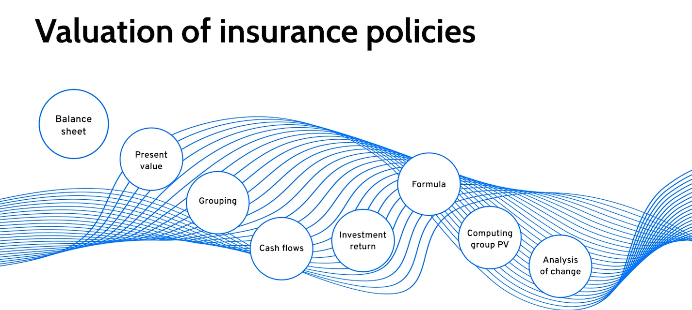
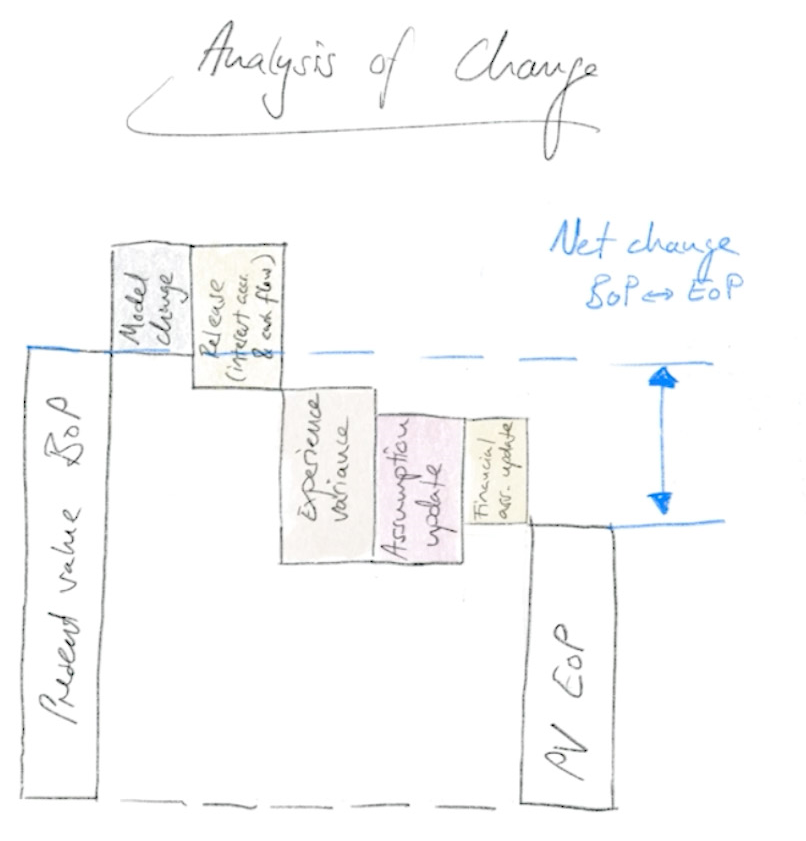

  Present Value Series 

# Overview

The goal of this project is to present some of the tools of the IFRS17 Calculation Engine. 
For this reason we compute the present values for the given financial products of insurance companies. 
The series consists of three videos. The first one gives a short introduction to the performed computations,
while the second and the third show how to perform these computations in the Systemorph Portal using the calculation engine.

# Episode 1

The first [video](https://systemorph-my.sharepoint.com/personal/amuolo_systemorph_com/_layouts/15/stream.aspx?id=%2Fpersonal%2Famuolo%5Fsystemorph%5Fcom%2FDocuments%2FMicrosoft%20Teams%20Chat%20Files%2F220921%2DSM%2DS1%2DE1%2DPV%2DV03%2Emp4&referrer=Teams%2ETEAMS%2DELECTRON&referrerScenario=p2p%5Fns%2Dbim&ga=1)
describes the computing the Present Value of the insurance contracts, which is the main goal of the IFRS 17 economic accounting standard.
Briefly, this is the fair price one would pay for all these insurance policies today. 

For computing present values, the insurance contracts are allocated to homogeneous groups usually formed by type, line of business, 
annual cohort to simplify reporting without a distinct loss of accuracy.
We will compute the present value for each group of insurance contracts individually.
This requires that all the cash flows are estimated and modelled until the product is run off.
These are the amounts of cash and cash equivalents being transferred into and out of a business, such as premium incomes, benefits ...

Because the growth of the market and the inflation, the time of the expected cash flow impacts the present value of that cash flow.
The timespan from now until the time of the cash flow is called maturity.
Therefore the present value of a cash flow is computed as the discounted cash flow and can be expressed through the following formula:

$$ \text{PresentValue} = \frac{\text{CashFlow}}{(1+\text{InterestRate})^{\text{MaturityYears}   }}.$$

The total present value of the policy is then the sum of present values of all cash flows.

Every period (Typically every quarter) an insurance company will need to prepare a statement of the present value of future cash flows. 
This statement is based on the value of a group of insurance contracts at the beginning of the period, its development throughout the period, and the value at the end of the period.
Different effects contribute to the change in value between the beginning and the end of a period and these effects are shown in the Analysis of Change.

In this analysis, we identify different components and their effects on the Present Value in the form of deltas, such as
 - Model correction for existing business, 
 - Actual cash flows (which may differ from prior expectation),
 - Interest accretion, where the interest on different amounts manifests itself over the period, 
 - Experience variance, new assessment by actuaries given newest developments,
 - Assumption updates, e.g., a new mortality table,
 - Financial assumption updates, e.g., a new yield curve,
 - Combined liabilities, a final run combining in-force and new business incl dependencies.

# Episode 2

The second [video](https://systemorph-my.sharepoint.com/personal/amuolo_systemorph_com/_layouts/15/stream.aspx?id=%2Fpersonal%2Famuolo%5Fsystemorph%5Fcom%2FDocuments%2FMicrosoft%20Teams%20Chat%20Files%2F220927%2DSM%2DS1%2DE2%2DV02%2Emp4&referrer=Teams%2ETEAMS%2DELECTRON&referrerScenario=p2p%5Fns%2Dbim&ga=1)
demonstrates the use of the IFRS17 calculation engine for computing the previously described present values. 
The values of the analyzed cash flows are stored in "Cashflows.xlsx," together with their description,
which are used by the computational notebook "PresentValues - Episode 2."
Furthermore the notebook uses the information about the interest rate stored in "YieldCurve.xlsx."
With this information, with few commands the calculation engine displays the wanted present values separated per each analysis of change step.

In the notebook further on, the computation of the present values is broken down and accompanied with charts of interest rates and cash flows.

# Episode 3

The third [video](https://systemorph-my.sharepoint.com/personal/amuolo_systemorph_com/_layouts/15/stream.aspx?id=%2Fpersonal%2Famuolo%5Fsystemorph%5Fcom%2FDocuments%2FMicrosoft%20Teams%20Chat%20Files%2FS01E03%2DV2%2Emp4&referrer=Teams%2ETEAMS%2DELECTRON&referrerScenario=p2p%5Fns%2Dbim&ga=1)
presents how to adapt the tools described in Episode 2 to the custom data set.
For that reason, three more spreadsheets representing cash flows are added,
along with two spreadsheets containing data about reporting nodes. 
The corresponding notebook "PresentValues - Episode 3" differs from the previous one 
only in the additional commands regarding importing the additional cash flows.
For all the changes please see the video.

